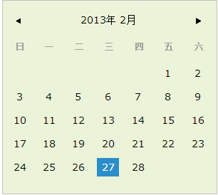

# calendar #

calendar是自动生成日历的jQuery插件

# calendar效果图 #

# 使用方法 #

引用css, js

<code html>
	&lt;link rel="stylesheet" type="text/css" href="calendar_ui.css" /&gt;
	
	&lt;script type="text/javascript" src="jquery-1.7.2.min.js"&gt;&lt;/script&gt;
	
	&lt;script type="text/javascript" src="calendar_ui.js"&gt;&lt;/script&gt;
</code>

<code javscript>
	$(".wrapper").calendar({});

</code>

# 高级方法 #

点击时间，返回选择的时间

<code javscript>
	$(".wrapper").calendar({
		dateClick:function(currentDate){return currentDate;}
	});
</code>

# demo  #

<a href="http://joannamo.github.com/calendar/calendar_ui.html">Calendar</a>
	
